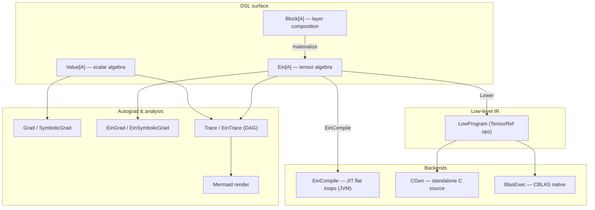

# Palladium

A Scala 3 framework for neural networks: pure-data expression trees,
reverse-mode automatic differentiation, an einsum-style tensor DSL, and a
lowering pipeline that emits portable C — all running on JVM, Scala.js, and
Scala Native.

> ## 🚧 UNDER CONSTRUCTION 🚧
>
> **This project is a work in progress and is not yet usable.** Nothing here is
> guaranteed to work, compile, or stay stable. APIs, types, and documentation
> may change or disappear without notice, and any published coordinates below
> are **not yet released**. Do not depend on this library yet — treat everything
> in this README as a statement of intent, not a promise.

> Status: **experimental, pre-1.0.** The API may shift between minor versions.
> The core scalar and tensor algebras are stable enough to build small models
> and exercise the codegen path end-to-end.

---

## A transformer, block by block

> **Note:** this DSL surface is still very much a work in progress and hasn't had
> a lot of attention yet — the `Scope`/named-dimension ergonomics shown below are
> being shaped as the rest of the library settles. Expect rough edges and naming
> to shift; treat the blocks here as a design sketch rather than a frozen API.

The fastest way to feel the library is to build a Transformer from scratch — not
by reaching for a `Transformer()` constructor, but by *deriving* one from a
handful of tiny, pure building blocks. Every block below is an ordinary
`Ein[Double] => Ein[Double]` function: it takes a tensor *expression* and returns
a bigger tensor expression. Nothing computes — we are assembling **data** that an
interpreter (eval, autograd, C codegen, BLAS) will later walk.

The whole trick of the DSL is **named dimensions**. Two operands that share a
dim name get *contracted* — summed over that axis, i.e. a matmul — while
everything else broadcasts element-wise. That single rule is enough to express
the entire attention mechanism.

```scala
import palladium.ein.*
import palladium.ein.EinDsl.*
import palladium.ein.EinDsl.syntax.*   // `.eval`, `.softmax`, `.elemMul`, …
import sourcecode.Name                 // a layer can read its own binding name

// The DSL's initializers (xavier, …) draw from an ambient java.util.Random.
given java.util.Random = java.util.Random(0L)

// `EinDsl.*` also brings an ambient `Scope` into play — a parameter-name prefix,
// rooted at the empty scope — so top-level params are named purely by binding,
// and a reusable layer just pushes a path segment onto it (Block 1).
```

### Block 0 — a named tensor and its shape

```scala
val seq   = 16.dim                 // Dim("seq", 16)   — sequence positions
val model = 64.dim                 // Dim("model", 64) — embedding width

val x = input[Double](seq, model)  // Ein.Input("x", [seq, model]); name = the val binding
x.outputDims                       // List(Dim("seq",16), Dim("model",64))
```

Dims are values. `16.dim` names itself after the binding (`seq`) via
`sourcecode.Name`, and `input` likewise takes its id from the `x` binding — so
the math reads the way you'd write it on a whiteboard.

### Block 1 — the linear layer (the one atom everything is made of)

A weight is *just data* and a linear layer is *just a contraction plus a
broadcasted bias*. For straight-line model code the DSL hands you `weight`,
`bias`, and `input` factories that name themselves after the `val` they're bound
to (via `sourcecode.Name`) and pick the `[out, in]` dim order for you — so
`w * x` is a matmul and the whole layer is a couple of readable lines, with no
`TensorData` and no hand-written names:

```scala
val features = 64.dim
val hidden   = 64.dim

val x = input[Double](features)              // Ein.Input("x", [features])
val w = weight(features -> hidden, xavier)   // Ein.Param("w", [hidden, features]), Xavier-init
val b = bias(hidden, zeros)                  // Ein.Param("b", [hidden]), zeros

val dense = relu(w * x + b)                  // a complete dense layer
```

Initializers are `xavier`, `zeros`, and `uniform(lo, hi)`; literal values work
too — `weight(features -> hidden, 1.0, 2.0, 3.0, …)`. The `->` is just a
`(Dim, Dim)` tuple, read as *from → to*.

Those factories take the param name from the binding — exactly what you want in
straight-line code, but *not* when you reuse a layer as a function. A Transformer
stamps out the same shape dozens of times, and each instance needs a *distinct*
parameter name; yet every `val` inside the function body is named the same on
every call. The binding alone is the wrong axis to disambiguate on.

The fix keeps the binding for the *leaf* name and adds an ambient `Scope` for the
*prefix*. `Scope` is a `given` threaded implicitly; `scoped("…")` pushes a path
segment onto it, and the leaf factories (`weight`, `bias`) prepend whatever scope
is in effect. So a reusable `linear` is still just `weight`/`bias` — no
`Ein.Param`, no `TensorData`, no `"…W"` string literals — and `sourcecode.Name`
supplies the scope segment from the call's *own* binding (`q`, `k`, `v`, …):

```scala
def linear(in: Dim, out: Dim)(x: Ein[Double])(using Scope, nm: Name, rng: java.util.Random): Ein[Double] =
  scoped(nm.value) {                  // push this call's binding (e.g. "q") onto the scope
    val w = weight(in -> out, xavier) // Ein.Param("q.w", [out, in]), Xavier-init
    val b = bias(out, zeros)          // Ein.Param("q.b", [out])
    (w * x) + b                       // `*` contracts the shared `in` dim; `+` broadcasts the bias
  }

// val proj = linear(model, model)(x)  ⟶  params "proj.w","proj.b";  shape [model, seq]
```

The discriminator now comes from the binding, so each `val q/k/v = linear(…)`
lands in its own scope automatically. Where there *is* no binding to capture — a
loop body — you push the index yourself with `scoped(s"h$h")`. That index is the
one honest string that survives, and it's *data* (a head number), not a
hand-written parameter name. This is the same trade-off the library's own `Block`
atoms make: scoped names, built generically.

### Block 2 — scaled dot-product attention (one head)

This is the heart of a Transformer, and it falls straight out of the contraction
rule. The catch: queries and keys both come from the same `[seq, model]` tensor,
so we must *rename* the key/value sequence axis — otherwise `Q × K` would contract
over `seq` too. `renameDim(seq -> kSeq)` is a zero-cost `Reshape` that swaps the
axis name (and the new `kSeq` even takes *its* name from its own binding). We pass
the `seq` dim in as a *value* rather than looking it up by string, so there isn't
a `"seq"` literal in sight. Then `Q × K` contracts only over `dk`, leaving a
`[seq, kSeq]` score matrix.

```scala
// scale every element by a constant: multiply by a Fill of the same shape
def scaleBy(e: Ein[Double], c: Double): Ein[Double] =
  e.elemMul(Ein.Fill(c, e.outputDims))

def attentionHead(model: Dim, dk: Dim, seq: Dim)(x: Ein[Double])(using Scope, java.util.Random): Ein[Double] =
  val kSeq = seq.size.dim                                       // Dim("kSeq", 16) — name from the binding
  val xKV  = x.renameDim(seq -> kSeq)                           // rename the key/value sequence axis

  val q = linear(model, dk)(x)                                  // params "q.*"  → [dk, seq]
  val k = linear(model, dk)(xKV)                                // params "k.*"  → [dk, kSeq]
  val v = linear(model, dk)(xKV)                                // params "v.*"  → [dk, kSeq]

  val scores  = scaleBy(q * k, 1.0 / math.sqrt(dk.size))        // [seq, kSeq]  (contracts dk)
  val weights = scores.softmax(kSeq)                            // [seq, kSeq]  (normalize keys)
  weights * v                                                   // [seq, dk]    (contracts kSeq)
```

Read the three contractions straight off the dim names: `q * k` shares `dk`,
`softmax(kSeq)` normalizes along the key axis, and `weights * v` shares `kSeq`. No
index arithmetic, no manual stride juggling, and — because `seq`/`kSeq` are passed
and bound as `Dim` values — no axis names typed as strings. The names *are* the
bookkeeping.

### Block 3 — multi-head attention

There's no batched-matmul op yet (it's on the roadmap), and we don't need one:
heads are independent, so we unroll them in plain Scala and *sum each head's
output projection*. Summing the per-head `Wᴼ` projections is mathematically
identical to concatenating the heads and projecting once.

```scala
def multiHead(model: Dim, heads: Int, dk: Dim, seq: Dim)(x: Ein[Double])(using Scope, java.util.Random): Ein[Double] =
  (0 until heads)
    .map { h =>
      scoped(s"h$h") {                                          // the one place an index appears
        val ctx = attentionHead(model, dk, seq)(x)              // params "h$h.q.*", …  → [seq, dk]
        val out = linear(dk, model)(ctx)                        // params "h$h.out.*"   → [model, seq]
        out
      }
    }
    .reduce(_ + _)                                              // [model, seq]
```

### Block 4 — the position-wise feed-forward network

```scala
def feedForward(model: Dim, hidden: Dim)(x: Ein[Double])(using Scope, java.util.Random): Ein[Double] =
  val up   = gelu(linear(model, hidden)(x))                    // params "up.*"    → [hidden, seq]
  val down = linear(hidden, model)(up)                         // params "down.*"  → [model, seq]
  down
```

### Block 5 — Add & Norm (residual + layer normalization)

`LayerNorm` carries its own learnable `scale`/`shift` params and the dims to
normalize over (named by `Dim` value — `model.name` — not a string). Element-wise
`+` matches operands *by name*, so the residual
works even though attention hands back `[model, seq]` and the input is
`[seq, model]`.

```scala
def layerNorm(model: Dim)(x: Ein[Double])(using Scope): Ein[Double] =
  val scale = param(model)(ones)                               // Ein.Param("…scale", [model]), ones
  val shift = param(model)(zeros)                              // Ein.Param("…shift", [model]), zeros
  Ein.LayerNorm(x, scale, shift, List(model.name), eps = 1e-5) // normalize over the model axis

// the classic "x + sublayer(x), then normalize"
def addNorm(model: Dim)(x: Ein[Double], sublayer: Ein[Double])(using Scope): Ein[Double] =
  layerNorm(model)(x + sublayer)
```

### Block 6 — assembling one Transformer block

Now the famous diagram is literally two `addNorm`s:

```scala
def transformerBlock(model: Dim, heads: Int, dk: Dim, hidden: Dim, seq: Dim)(x: Ein[Double])(using Scope, java.util.Random): Ein[Double] =
  val attn = scoped("attn") { multiHead(model, heads, dk, seq)(x) }
  val a    = scoped("ln1")  { addNorm(model)(x, attn) }
  val ff   = scoped("ffn")  { feedForward(model, hidden)(a) }
  val b    = scoped("ln2")  { addNorm(model)(a, ff) }
  b   // shape preserved: [seq, model] in, [seq, model] out

// stacking is ordinary function composition, because the shape round-trips:
def encoder(layers: Int, model: Dim, heads: Int, dk: Dim, hidden: Dim, seq: Dim)(x: Ein[Double])(using Scope, java.util.Random): Ein[Double] =
  (0 until layers).foldLeft(x)((h, i) => scoped(s"layer$i") { transformerBlock(model, heads, dk, hidden, seq)(h) })
```

### Block 7 — a complete model you can actually run

Embed token ids (a `Gather` over an embedding table), add a learned positional
table, run the encoder stack, and project to vocabulary logits. Because the
embedding table, positions, and all weights are `Param`s — and the token ids are
concrete data — the whole thing evaluates with an *empty* feed.

```scala
val vocab  = 1000.dim
val heads  = 4
val dk     = 16.dim                                  // 4 heads × 16 = 64 = model
val hidden = 256.dim

// a sentence of 16 token ids, as concrete integer data
val ids   = TensorData.fromArray(List(seq), Array.tabulate(seq.size)(i => (i * 7) % vocab.size))
val table = param(vocab, model)(xavier)              // Ein.Param("table", [vocab, model])
val pos   = param(seq, model)(zeros)                 // Ein.Param("pos",   [seq, model])

val embedded = Ein.Gather(table, ids, vocab.name)    // [seq, model]  (look up the "vocab" axis)
val h0       = embedded + pos                         // [seq, model]
val out      = encoder(layers = 2, model, heads, dk, hidden, seq)(h0)
val logits   = linear(model, vocab)(out)             // params "logits.*"  → [vocab, seq]
val probs    = logits.softmax(vocab)                 // next-token distribution per position

val result: TensorData[Double] = probs.eval()        // forward pass — actually computes!
```

That's a working Transformer expressed entirely in pure data. Every other
interpreter in the library is likewise just a function over `probs`:

```scala
import palladium.codegen.{Lower, CGen}

val program = Lower.lower(probs)        // erase named dims → index-based IR
val cSource = CGen.generate(program)    // → self-contained, dependency-free C
probs.backward()                        // reverse-mode tensor autodiff → Map[String, TensorData]
EinTrace.forward(probs)                 // a DAG you can render with Mermaid
```

### The same thing, batteries included

These blocks aren't just a tutorial — the library ships them as composable
`Block` atoms, so the entire stack above collapses to:

```scala
import palladium.ein.Block
import palladium.ein.Block.{*, given}

val net: Ein[Double] =
  (input[Double](seq, model)
    >> Block.transformer[Double](nLayers = 2, nHeads = 4, headDim = 16, ffDim = 256, seqLen = 16)
    >> Block.layerNorm[Double](List("model"))).materialize
```

Notice what we *didn't* need anywhere: no special "attention type," no shape
generics, no framework base class. A Transformer is just `linear`, contraction,
`softmax`, `LayerNorm`, and `+` — composed with ordinary Scala. The rest of this
document is about the algebras, interpreters, and backends that make that
possible.

---

## Why Palladium

Palladium is built around a single idea: an expression tree is just data, and
every concern — evaluation, gradients, visualization, code generation, BLAS
execution — is a separate interpreter walking that tree. Adding a new backend
or a new analysis never requires changing the ADTs.

| Feature                         | What it gives you                                                              |
|---------------------------------|--------------------------------------------------------------------------------|
| Pure Scala 3                    | No JNI surprises in the core; idiomatic enums, extensions, given instances.    |
| Cross-platform                  | One source tree compiles to JVM, Scala.js, and Scala Native.                   |
| Scalar autodiff                 | `Value[A]` expression algebra with reverse-mode `Grad` and `SymbolicGrad`.     |
| Tensor DSL                      | Named-dim Einstein contraction (`ein.EinDsl`) with broadcasting & reductions. |
| Composable layers               | `Block` algebra: `>>`, `* n`, residuals, MLPs and transformer building blocks. |
| Low-level IR + C codegen        | `codegen.Lower` → `LowProgram` → `codegen.CGen` emits self-contained C.        |
| Native BLAS backend             | CBLAS FFI on Scala Native (`palladium.blas`) — `dgemm`, `dgemv`, `daxpy`, …    |
| SafeTensors I/O                 | Load and save weights via the [`safetensors-scala`][st] sibling library.       |
| Graph visualization             | `Mermaid` renders traced graphs with KaTeX labels and gradient annotations.    |
| Trace/debug tools               | `Trace.forward` → flat DAG with per-edge local derivatives.                    |
| Browser playground              | Scala.js frontend module for live evaluation and visualization in a webapp.    |
| HTTP API                        | Tapir + Netty server exposing eval, gradient, symbolic gradient, trace.        |

[st]: https://github.com/no-virtual-architect/safetensors-scala

---

## Architecture



Two algebras at the top (`Value` for scalars, `Ein` for tensors), one IR at the
bottom (`LowProgram`), and a fan of interpreters in between. Block composition
desugars into `Ein`; everything downstream of `Ein` is opt-in.

---

## Installation

Palladium is currently consumed by building from source (see [Building from
source](#building-from-source)). Once published, coordinates will follow the
Mill cross-platform layout:

```scala
// JVM
mvn"<group>::palladium::<version>"
// Scala.js
mvn"<group>::palladium::<version>"
// Scala Native (includes the BLAS backend)
mvn"<group>::palladium::<version>"
```

The supported Scala 3 series is **3.8.x**.

---

## Quick start

### 1. Scalar autodiff in three lines

```scala
import palladium.*
import palladium.Dsl.*

val x = 2.0.^                       // Value.Var("x", 2.0) — name from binding
val y = 3.0.^
val f = x * x + y.sin               // builds tree, does not compute yet

f.eval                              // 4.1411...
Grad.backward(f)                    // Map("x" -> 4.0, "y" -> -0.9899...)
```

`Dsl.^` lifts a number into a tracked variable named after the binding, using
`sourcecode.Name`. `Grad.backward` runs a reverse-mode pass and returns the
gradient for every `Var`.

### 2. A type-safe MLP

```scala
import palladium.*
import palladium.nn.MLP
import palladium.Loss

// Compile-time shape: 2 → 4 → 1, Xavier init, tanh hidden layers, linear out.
val mlp = MLP.init[(2, 4, 1)](seed = 42L)

val inputs  = Vector(Value.Var("x0", 1.0), Value.Var("x1", 0.5))
val targets = Vector[Value[Double]](Value.Lit(1.0))

val out  = mlp.forward(inputs)
val loss = Loss.mse(out, targets)
val grads = Grad.backward(loss)

val sgd = Optimizer.SGD[Double](learningRate = 0.01)
val updated = mlp.withParams(sgd.step(mlp.params, grads))
```

### 3. An einsum-style tensor expression

```scala
import palladium.ein.*
import palladium.ein.EinDsl.*
import palladium.ein.EinDsl.syntax.*

val inp = 2.dim                       // Dim("inp", 2)
val hid = 3.dim                       // Dim("hid", 3)

val x  = input[Double](inp)           // Ein.Input("x", List(inp))
val W  = weight(inp -> hid, 1.0, 2.0, 3.0, 4.0, 5.0, 6.0)
val y  = W * x                        // Einstein contraction over "inp"

val result = y.eval(x.data(1.0, 2.0))
// TensorData with shape [hid = 3] and values [5.0, 11.0, 17.0]
```

Shared dim names between operands trigger contraction; everything else is
element-wise with broadcasting on shape mismatch.

### 4. Compose a network with `Block` and lower it to C

```scala
import palladium.ein.*
import palladium.ein.EinDsl.*
import palladium.ein.Block.{*, given}
import palladium.codegen.{Lower, CGen}

given java.util.Random = java.util.Random(0L)

val features = 784.dim
val x = input[Double](features)

val net: Ein[Double] =
  (x
    >> dense(128, Activation.ReLU, xavier)
    >> dense(64,  Activation.ReLU, xavier)
    >> linear(10, xavier)).materialize

val program = Lower.lower(net)        // Ein → index-based IR
val cSource = CGen.generate(program)  // LowProgram → portable C
// gcc -O2 -lm model.c -o model
```

`>>` sequences blocks; `block * n` repeats; `block.residual` wraps in a skip
connection. The generated C declares static buffers for every parameter,
input, and temporary, reads them from stdin, runs the forward pass, and writes
outputs to stdout — no malloc, no dynamic allocation.

`Trace.forward(expr)` + `Mermaid.render(graph, grads, …)` produces a
`flowchart TD` block with KaTeX-formatted node and edge labels for paste-in
visualization in any Mermaid renderer.

---

## Scalar layer: `Value[A]`

`Value[A]` is an enum of 20+ constructors (`Var`, `Lit`, `Const`, `Add`,
`Mul`, `Sub`, `Div`, `FastDiv`, `Pow`, `Neg`, `Log`, `Exp`, `Tanh`, `Sigmoid`,
`Relu`, `Sin`, `Cos`, `Abs`, `Step`, `Signum`). Operators are pure tree
builders — nothing evaluates until an interpreter walks the tree.

| Constructor | Purpose                                          | Example                |
|-------------|--------------------------------------------------|------------------------|
| `Const(n)`  | Structural integer constants in formulas         | the `2` in `2x + 1`    |
| `Lit(data)` | A concrete value in your numeric type            | measured input         |
| `Var(id,d)` | A named, gradient-tracked variable               | `x` in `∂f/∂x`         |

### Interpreters over `Value[A]`

| Object                   | Output                       | Notes                                                       |
|--------------------------|------------------------------|-------------------------------------------------------------|
| `expr.eval`              | `A`                          | Forward pass via `NumberLike[A]`.                           |
| `Grad.backward`          | `Map[String, A]`             | Reverse-mode autodiff, sums gradients across duplicate vars.|
| `SymbolicGrad.backward`  | `Map[String, Value[A]]`      | Symbolic gradient *expressions* — defer execution.          |
| `AutoGrad.trace`         | `Traced[A]`                  | Bundles forward value with the gradient map.                |
| `Trace.forward`          | `TracedGraph[A]`             | Flat DAG with deduplication; suitable for visualization.    |
| `Trace.backward`         | `Map[Int, A]`                | Reverse pass over the DAG (per-node gradient).              |
| `Trace.localDerivatives` | `Map[(Int, Int), A]`         | Per-edge local partials for diagnostics.                    |
| `Mermaid.render`         | `String`                     | Renders a traced graph as a Mermaid flowchart.              |

### Losses, optimizers, and `NumberLike[A]`

`Loss` provides `mse`, `binaryCrossEntropy`, and `categoricalCrossEntropy`
(plus extension-method syntax). `Optimizer.SGD[A]` and `Optimizer.AdamW[A]`
(default β₁=0.9, β₂=0.999, ε=1e-8, weight decay 0.01) take a `Map[String, A]`
parameter map and produce an updated one.

`NumberLike[A]` is a small (~20 method) typeclass that parameterizes every
interpreter over the numeric type. Built-in instances for `Double` and
`Float`; implement it for your own type (e.g. `BigDecimal`) and all the
existing interpreters work unchanged.

---

## Tensor layer: `Ein[A]`

Tensors carry **named dimensions**. Shared names between operands trigger
Einstein contraction (automatic summation over the shared axis):

```scala
// W[hid, inp] × x[inp] → y[hid]                  (contracts over "inp")
// Q[seq, qd] × K[kSeq, qd] → scores[seq, kSeq]   (contracts over "qd")
```

`Ein[A]` covers the usual building blocks:

| Category       | Variants                                                                 |
|----------------|--------------------------------------------------------------------------|
| Leaves         | `Param`, `Input`, `Fill`, `Ones`, `Zeros`                                |
| Contraction    | `Contract` (sums over shared named dims)                                 |
| Element-wise   | `ElemAdd`, `ElemSub`, `ElemMul` (with broadcasting)                      |
| Activations    | `Activate(f, arg)`, `ActivateDeriv(f, arg)` over ReLU/Sigmoid/Tanh/GELU/Swish |
| Shape          | `ReduceSum`, `Broadcast`, `Transpose`, `Reshape`, `Slice`                |
| Normalization  | `Softmax`, `LogSoftmax`, `LayerNorm`                                     |
| Indexing       | `Gather`, `Scatter`                                                      |

### Operators

```scala
W × X         // Contract (Unicode ×)
W * X         // Contract (ASCII alias)
A + B         // Element-wise add with broadcasting
A - B         // Element-wise subtract
A.elemMul(B)  // Hadamard product
A.t("dim2", "dim1") // transpose by name
A.sumOver("dim")    // reduction
A.softmax("class")  // normalized along a named dim
```

### Convenience factories — `EinDsl`

```scala
import palladium.ein.EinDsl.*

val inp = 784.dim
val hid = 128.dim

val x = input[Double](inp)               // name comes from the val binding
val W = weight(inp -> hid, xavier)       // Xavier-initialized weight
val b = bias(hid, zeros)                 // zero-initialized bias

val h = relu(W * x + b)                  // standard dense layer
```

Initializers: `xavier`, `uniform(low, high)`, `zeros`.

### Interpreters over `Ein[A]`

| Object             | Output                              | Notes                                                       |
|--------------------|-------------------------------------|-------------------------------------------------------------|
| `EinEval.eval`     | `TensorData[A]`                     | Forward, with numerically stable softmax.                   |
| `EinGrad.backward` | `Map[String, TensorData[A]]`        | Reverse-mode tensor autodiff (contraction grads).            |
| `EinSymbolicGrad`  | `Map[String, Ein[A]]`               | Symbolic gradient *expressions*.                            |
| `EinTrace.forward` | `EinTracedGraph[A]`                 | DAG for visualization & architecture detection.             |
| `EinArch.detect`   | `NetworkArch`                       | Pattern-match dense layers in a traced graph.               |
| `EinCompile.compile` | `CompiledMLP`                     | JIT to pre-allocated arrays and tight while-loops (JVM).    |
| `Lower.lower`      | `LowProgram`                        | Erase named dims; emit index-based IR.                      |

### Block composition

```scala
enum Block[A]:
  case Atom(factory: (Ein[A], String, Option[String]) => Ein[A])
  case Sequence(blocks: Vector[Block[A]])
  case Repeat(block: Block[A], n: Int)
  case Residual(block: Block[A])
```

Built-in atomic blocks include `dense`, `linear`, `activate`, `fn`, `gelu`,
`swish`, `softmax`, `logSoftmax`, `layerNorm`, `embedding`, plus transformer
helpers (`attention`, `multiHeadAttention`, `feedForward`, `transformerBlock`,
`transformer`). Curated example architectures live in `NetworkExamples`
(`twoLayerMlp`, `mnistClassifier`, `tinyTransformer`).

---

## Code generation and BLAS

The pipeline is `Ein[Double]` → `Lower.lower` → `LowProgram` → backend.
`LowProgram` is the canonical low-level IR: named dims are erased into integer
shapes, params and inputs become `TensorRef(id, shape)`, and operations are a
small enum (`MatMul`, `ElemBinary`, `Activate`, `Softmax`, `LayerNorm`,
`ReduceSum`, `Broadcast`, `Copy`, `FillOnes`, `FillZeros`, `Reshape`,
`LogSoftmax`, `ActivateDeriv`, `Gather`, `Scatter`).

**C backend (`CGen`)** — generates dependency-free C with static buffers,
tight nested loops, inlined GELU/Swish, numerically stable softmax (max
subtraction), and a `main` that reads inputs and weights from stdin and writes
outputs to stdout. Compile with `gcc -O2 -lm`.

**Native BLAS backend (Scala Native only)** — `palladium.blas` binds a minimal
CBLAS surface (`dgemm`, `dgemv`, `ddot`, `daxpy`, `dscal`, `dcopy`, `dnrm2`,
`dasum`) through Scala Native FFI and dispatches `LowProgram` operations by
shape:

| Shape                  | Dispatch                                |
|------------------------|-----------------------------------------|
| Matrix × Matrix        | `cblas_dgemm`                           |
| Matrix × Vector        | `cblas_dgemv`                           |
| Vector × Matrix        | `cblas_dgemv` (transpose)               |
| Vector · Vector        | `cblas_ddot`                            |
| Element-wise Add/Sub   | `cblas_dcopy` + `cblas_daxpy` fast path |

`NativeTensor` wraps a raw `Ptr[Double]` allocated from a Scala Native `Zone`
(arena), so the inner training loop is GC-free. Buffers are released when the
enclosing `Zone` exits.

---

## SafeTensors integration

Palladium reads and writes model weights in the [SafeTensors][safetensors]
format via the sibling open-source library `safetensors-scala`:

```scala
import palladium.ein.safetensors.SafeTensors

val bytes = os.read.bytes(os.pwd / "weights.safetensors")
val params = SafeTensors.loadAll[Double](
  bytes,
  dimMapping = {
    case "embed.weight" => List("vocab", "embed")
    case "lm_head.weight" => List("vocab", "embed")
    case other => sys.error(s"unknown tensor: $other")
  }
)
```

`safetensors-scala` is itself a small, dependency-light Scala library and is
declared as an ordinary build dependency.

[safetensors]: https://github.com/huggingface/safetensors

---

## Modules

| Module              | Purpose                                                                             |
|---------------------|-------------------------------------------------------------------------------------|
| `palladium`         | Core cross-platform library: scalar + tensor algebras, autograd, IR, BLAS (Native). |
| `benchmark`         | JVM micro-benchmarks comparing the interpreted and JIT-compiled tensor backends.    |
| `benchmark-native`  | Scala Native benchmarks: interpreted vs. JIT-compiled vs. CBLAS.                    |
| `web-server`        | Tapir + Netty REST API: evaluate, gradient, symbolic-gradient, trace endpoints.     |
| `web-frontend`      | Scala.js module exported as ES modules for a Vite-based browser playground.         |

The core module is cross-built; you address a specific platform by its axis:
`palladium.jvm`, `palladium.js`, `palladium.native`.

---

## Platform support

| Platform      | Status      | Notes                                                                   |
|---------------|-------------|-------------------------------------------------------------------------|
| JVM           | Primary     | Reference interpreter, JIT-compiled MLP backend, server, benchmarks.    |
| Scala.js      | Supported   | All non-native code; ES module output for browser integration.          |
| Scala Native  | Supported   | Adds the `palladium.blas` BLAS backend; requires a system CBLAS.        |

BLAS bindings are **native-only**: `palladium.blas` is not present on the JVM
or JS source trees. Everything else is shared.

---

## Building from source

### Prerequisites

- A recent JDK (JVM 17+).
- [Mill](https://mill-build.com/) 1.1.x. The build is `build.mill`-style and
  works with the `mill` launcher in `PATH`.
- Node.js, if you plan to run the Vite-backed frontend.
- A system CBLAS (e.g. OpenBLAS) when building the Scala Native module. Point
  Mill at it via `BLAS_LIB_PATH=/path/to/lib`.

This project has no Nix devshell — it's plain Mill + JDK + (optional) Node.

### Make targets

```bash
make help                  # list all available targets

# Compile
make compile               # core JVM + core JS + web-frontend + web-server
make compile-js            # web-frontend (Scala.js) only
make compile-native        # core Scala Native module
make compile-server        # web-server (JVM) only

# Test
make test                  # all JVM + JS tests
make test-js               # JS platform tests only
make test-native           # Scala Native tests (BLAS backend)
make test-only T=EinDsl    # single suite by name substring
make test-only-w T=EinDsl  # same, in watch mode
make test-native-w         # native tests in watch mode
```

### Direct Mill invocations

```bash
mill palladium.jvm[3.8.2].compile
mill palladium.jvm[3.8.2].test
mill palladium.js[3.8.2].test
mill palladium.native[3.8.2].test
```

### Formatting

Scalafmt 3.10.4 with `runner.dialect = scala3`. Run:

```bash
mill mill.scalalib.scalafmt.ScalafmtModule/reformatAll
```

---

## Running

### JVM benchmark — compiled vs. interpreted tensor backend

```bash
make benchmark
```

This builds the standard 3 → 4 → 4 → 1 MLP (tanh, MSE), warms up both backends,
and prints forward and training times along with the speedup of the JIT-
compiled backend over the tree-walking interpreter.

### Scala Native benchmark — adds the BLAS backend

```bash
make benchmark-native
```

Same network, with the additional CBLAS backend. Requires a working system
CBLAS at `BLAS_LIB_PATH` (or available via the standard linker search path).

### Web server (Tapir + Netty)

```bash
make server-run            # listens on :8080
```

REST endpoints:

| Endpoint                   | Method | Purpose                                           |
|----------------------------|--------|---------------------------------------------------|
| `/api/health`              | GET    | Liveness probe.                                   |
| `/api/evaluate`            | POST   | Parse + evaluate an expression.                   |
| `/api/gradient`            | POST   | Numerical gradients via `Grad.backward`.          |
| `/api/symbolic-gradient`   | POST   | Symbolic gradient expressions.                    |
| `/api/trace`               | POST   | Traced DAG + Mermaid diagram + per-edge derivs.   |

The server includes a small recursive-descent parser so callers can submit
expressions like `"x * y + sin(x)"` directly.

### Web frontend (Scala.js + Vite)

```bash
make dev-all               # compile, fastLinkJS, symlink, npm install

# Then, in separate terminals:
make web-dev               # Vite dev server
make server-run            # backend API on :8080
make js-watch-fast         # auto-rebuild Scala.js on changes
```

The Scala.js module exports top-level functions (`evaluateExpression`,
`getGradients`, `getSymbolicGradients`, `toMermaidGraph`, `initMLP`,
`mlpForward`, `mlpGradients`, …) so they can be invoked directly from the
Vite-bundled JavaScript front-end.

---

## Project layout

```
palladium/
  build.mill                          # Mill modules and cross-platform config
  Makefile                            # common workflows
  deps/                               # pinned versions + Maven coordinates
  palladium/
    src/palladium/                    # shared sources (JVM + JS + Native)
      Value.scala  Grad.scala  SymbolicGrad.scala  AutoGrad.scala
      NumberLike.scala  Dsl.scala  Trace.scala  Mermaid.scala
      Loss.scala  Optimizer.scala  nn/MLP.scala
      ein/                            # tensor algebra + Block DSL + losses
      ein/safetensors/                # SafeTensors integration
      codegen/                        # LowIR, Lower, CGen
    src-native/palladium/blas/        # Scala Native only — CBLAS backend
    test/src/palladium/               # shared tests
    test/test-native/palladium/blas/  # BLAS-specific tests
  benchmark/                          # JVM benchmarks
  benchmark-native/                   # Scala Native benchmarks
  web-server/                         # Tapir + Netty HTTP API
  web-frontend/                       # Scala.js + Vite playground
  data/                               # sample datasets
```

---

## Roadmap

The current focus is consolidating the lowering pipeline. Planned directions,
in rough priority order:

- **CUDA backend.** Bind `cudart` + `cublas` through Scala Native FFI, with
  hand-written element-wise kernels for activations, MSE output gradient, and
  rank-1 weight updates so the inner loop never round-trips through host
  memory. A later phase explores NVRTC-fused per-layer kernels.
- **More tensor ops.** Convolution and batched matmul are not in the current
  `Ein` algebra; both are candidates once the codegen and BLAS paths are
  stable enough to add new ops in one place.
- **Training-loop helpers.** Higher-level scaffolding around `EinCompile`,
  optimizers, and SafeTensors I/O so end-to-end training fits in a few lines.
- **Quantization.** Lower precision (`F16`/`BF16`) variants of `LowProgram`
  with matching backend dispatch.
- **Richer graph visualizations.** Tensor-level Mermaid rendering with
  contraction labels and shape annotations.

---

## Contributing

Bug reports, design feedback, and pull requests are welcome. Before opening a
PR, run `make test` (and `make test-native` if you touched the BLAS backend)
and reformat with `mill mill.scalalib.scalafmt.ScalafmtModule/reformatAll`.

The codebase deliberately favours **plain data + small interpreters** over
deep type-class hierarchies. If you find yourself wanting to add a method to
`Value` or `Ein`, it's usually better to add a new top-level interpreter.

---

## License

Apache License, Version 2.0 — see [LICENSE.md](LICENSE.md).
